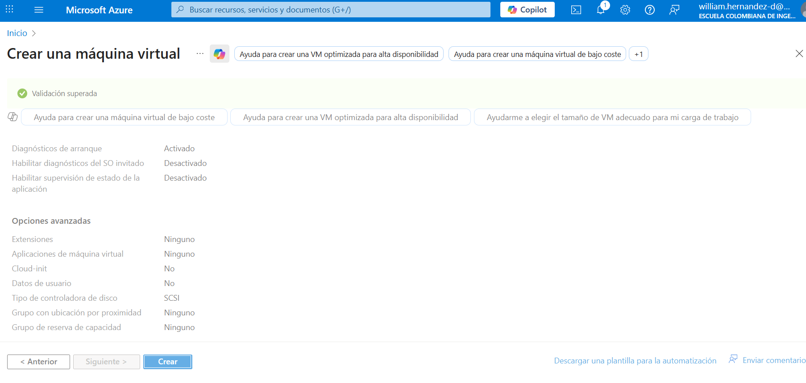
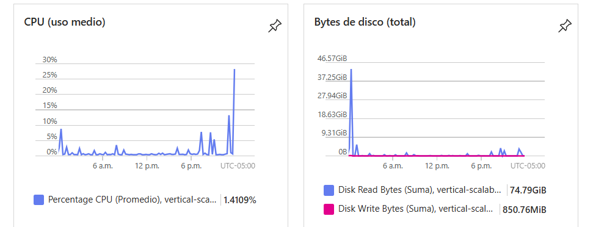
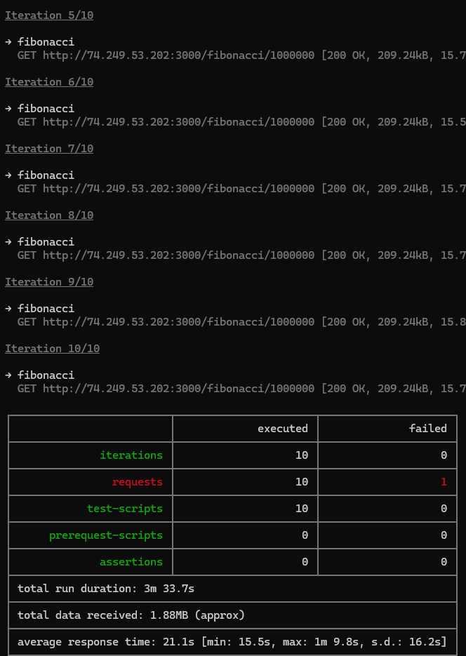
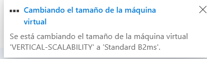
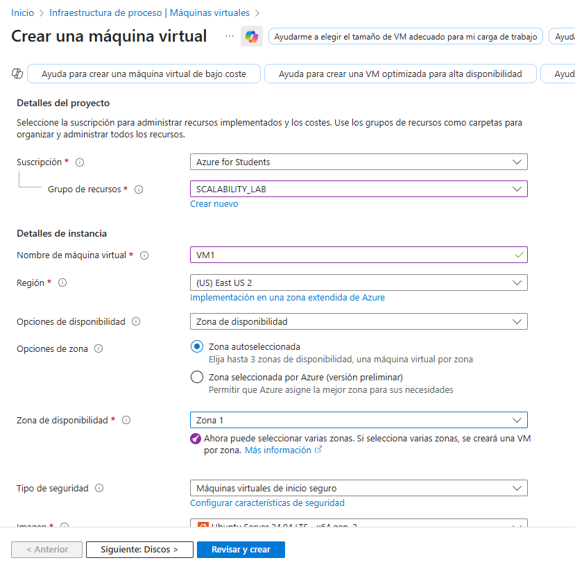
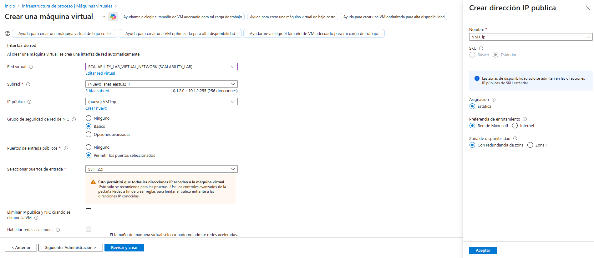
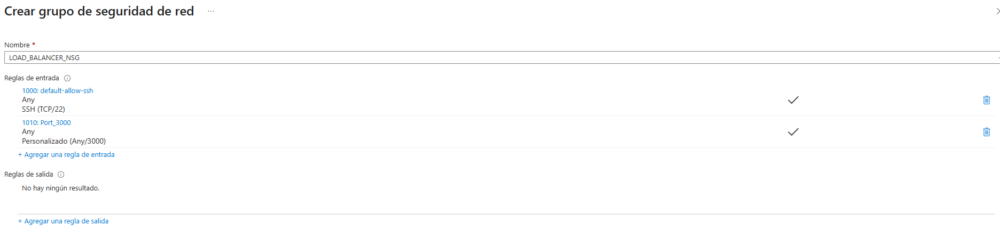
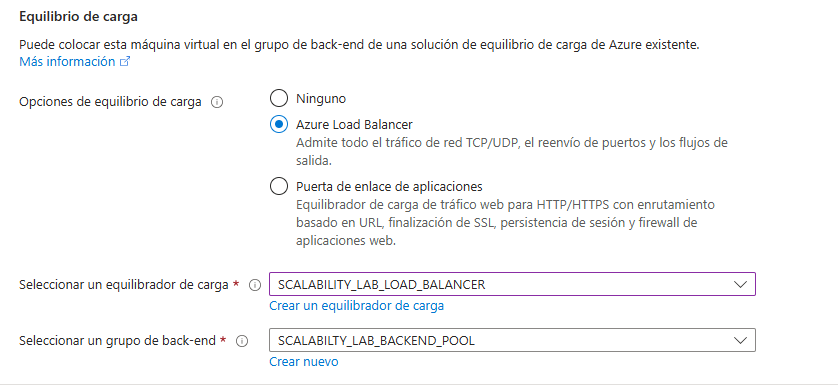
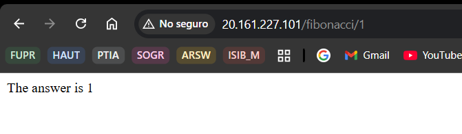

### Escuela Colombiana de Ingeniería
### Arquitecturas de Software - ARSW

### Integrantes
- William Camilo Hernandez Deaza
- Manuel David Robayo Vega

## Escalamiento en Azure con Maquinas Virtuales, Sacale Sets y Service Plans

### Dependencias
* Cree una cuenta gratuita dentro de Azure. Para hacerlo puede guiarse de esta [documentación](https://azure.microsoft.com/es-es/free/students/). Al hacerlo usted contará con $100 USD para gastar durante 12 meses.

### Parte 0 - Entendiendo el escenario de calidad

Adjunto a este laboratorio usted podrá encontrar una aplicación totalmente desarrollada que tiene como objetivo calcular el enésimo valor de la secuencia de Fibonnaci.

**Escalabilidad**
Cuando un conjunto de usuarios consulta un enésimo número (superior a 1000000) de la secuencia de Fibonacci de forma concurrente y el sistema se encuentra bajo condiciones normales de operación, todas las peticiones deben ser respondidas y el consumo de CPU del sistema no puede superar el 70%.

### Parte 1 - Escalabilidad vertical

1. Creamos la maquina virtual con las caracteristicas pedidas




2. Desde nuestra maquina local nos conectamos usando el comando

    `ssh scalability_lab@xxx.xxx.xxx.xxx`


3. Instalamos Node con las especificaciones recomendadas


4. Clonamos la aplicación en la maquina virtual


5. Ejecutamos la aplicación en el servidor para que quede corriendo


6. Creamos una regla Inbound Rule en Azure


7. Desde el navegador comprobamos el endpoint: 


    


8. Verificamos el consumo de la CPU 



9. Usando la carpeta de PostMan corroboramos el funcionamiento



10. La cantidad de CPU consumida es bastante grande y un conjunto considerable de peticiones concurrentes pueden hacer fallar nuestro servicio. Para solucionarlo usaremos una estrategia de Escalamiento Vertical. En Azure diríjase a la sección *size* y a continuación seleccione el tamaño `B2ms`.



11. Una vez el cambio se vea reflejado, repita el paso 7, 8 y 9.


12. Evalue el escenario de calidad asociado al requerimiento no funcional de escalabilidad y concluya si usando este modelo de escalabilidad logramos cumplirlo.


13. Vuelva a dejar la VM en el tamaño inicial para evitar cobros adicionales.

**Preguntas**

### Respuestas a las preguntas (Parte 1)

1. ¿Cuántos y cuáles recursos crea Azure junto con la VM?
   - Recursos típicos: `Virtual Machine`, `Network Interface (NIC)`, `OS Disk` (Managed Disk), `Public IP` (si se pidió), `Network Security Group (NSG)` y sus reglas, `Virtual Network (VNet)` + `Subnet`, (opcional) `Storage Account` para boot diagnostics, y (opcional) `Availability Set` o asignación a `Availability Zone`.

2. ¿Brevemente describa para qué sirve cada recurso?
   - `Virtual Machine`: instancia donde corre la app.
   - `NIC`: interfaz de red que conecta la VM a la red.
   - `OS Disk`: disco del sistema operativo y archivos de la VM.
   - `Public IP`: hace accesible la VM desde Internet.
   - `NSG`: controla reglas de entrada/salida (security).
   - `VNet/Subnet`: segmento de red privado donde se despliegan recursos.
   - `Storage Account`: almacena diagnósticos y snapshots.
   - `Availability Set/Zone`: mejora disponibilidad y tolerancia a fallos.

3. ¿Por qué se cae la app al cerrar la conexión SSH y por qué crear una `Inbound port rule`?
   - La app se ejecutó en primer plano dentro de la sesión SSH; al cerrar la sesión el shell envía SIGHUP y termina procesos hijos. Soluciones: usar `forever`, `pm2`, `nohup`, `screen`/`tmux` o un servicio `systemd` para ejecutar la app en background.
   - La `Inbound port rule` en el NSG habilita tráfico entrante (p. ej. puerto 3000). Sin esa regla, Azure bloquea por defecto el acceso desde Internet.


5. Imagen consumo de CPU (placeholder) e interpretación:
   
   - Interpretación: la CPU se eleva porque la rutina de Fibonacci ejecuta operaciones intensivas en CPU en el proceso principal. En VM pequeñas el porcentaje puede llegar al 100% de los vCPU asignados, provocando cola de peticiones y latencia.

6. Resumen de Postman (placeholder) e interpretación:
7. 
   - Interpretación: tiempos por petición aumentan con `n` y con concurrencia; si aparecen fallos suelen ser timeouts o 5xx causados por bloqueo de CPU o por colas que agotan recursos. Documentar códigos de estado, tiempos máximos y cantidad de errores en la tabla de resultados.

7. Diferencia entre tamaños `B2ms` y `B1ls` (no solo specs):
   - `B-series` son máquinas burstable con créditos de CPU: `B2ms` ofrece 2 vCPU y más memoria y mayor baseline de CPU que `B1ls`. `B1ls` es un SKU muy económico y limitado (menos memoria, menor throughput de disco/red).
   - Más allá de specs: la experiencia varía en capacidad sostenida (B2ms mantiene mejor rendimiento sostenido), latencia de I/O y tolerancia al trabajo CPU-bound. `B1ls` puede ser suficiente para cargas muy ligeras pero no para cálculos intensivos.

8. ¿Aumentar el tamaño de la VM es buena solución? ¿Qué pasa con la FibonacciApp al cambiar el tamaño?
   - Subir tamaño ayuda a corto plazo (más vCPU, más RAM → menor latencia). No es solución escalable ni tolerante a fallos.
   - Al cambiar tamaño Azure desasigna/reasigna la VM (detiene/reinicia), por lo que la `FibonacciApp` se interrumpe y debe reiniciarse o gestionarse automáticamente con `forever`/`pm2`/servicio.

9. ¿Qué pasa con la infraestructura al cambiar tamaño? Efectos negativos:
   - Azure dealloca y reprovisiona la VM: downtime temporal, posible cambio de IP si no es estática, reinicio de servicios, coste mayor, y límites de cuotas. Escalar verticalmente no elimina single-point-of-failure y puede ser costoso a mediano/largo plazo.

10. ¿Hubo mejora en consumo de CPU o tiempos? Sí/No y por qué:
   - Generalmente sí: VM más grande reduce porcentaje de uso por núcleo y disminuye latencia por petición. Pero la mejora no siempre es proporcional: si la app es single-threaded, añadir vCPUs no se aprovecha completamente sin paralelismo (worker threads, clustering o múltiples instancias). Además, en contención de I/O o GC la mejora puede ser limitada.

11. Aumentar ejecuciones paralelas a `4`: ¿mejora porcentual?
   - Con una sola VM el throughput puede mejorar hasta saturar CPU → luego los tiempos por petición aumentan y errores pueden aparecer. La mejora porcentual es limitada por la CPU disponible y la naturaleza single-threaded. Con escalamiento horizontal (varias VMs + Load Balancer) la mejora es más lineal y la tasa de éxito suele aumentar porque las peticiones se distribuyen entre instancias.


### Parte 2 - Escalabilidad horizontal

#### Crear el Balanceador de Carga

Antes de continuar puede eliminar el grupo de recursos anterior para evitar gastos adicionales y realizar la actividad en un grupo de recursos totalmente limpio.

1. Creamos el balanceador de carga


2. Creamos la Backend Pool


3. Creamos el Health Probe


4. Creamos la regla del balanceador


5. Creamos la red Virtual


#### Crear las maquinas virtuales (Nodos)

Ahora vamos a crear 3 VMs (VM1, VM2 y VM3) con direcciones IP públicas standar en 3 diferentes zonas de disponibilidad. Después las agregaremos al balanceador de carga.

1. En la configuración básica de la VM guíese por la siguiente imágen. Es importante que se fije en la "Avaiability Zone", donde la VM1 será 1, la VM2 será 2 y la VM3 será 3.



2. En la configuración de networking, verifique que se ha seleccionado la *Virtual Network*  y la *Subnet* creadas anteriormente. Adicionalmente asigne una IP pública y no olvide habilitar la redundancia de zona.



3. Para el Network Security Group seleccione "avanzado" y realice la siguiente configuración. No olvide crear un *Inbound Rule*, en el cual habilite el tráfico por el puerto 3000. Cuando cree la VM2 y la VM3, no necesita volver a crear el *Network Security Group*, sino que puede seleccionar el anteriormente creado.



4. Ahora asignaremos esta VM a nuestro balanceador de carga, para ello siga la configuración de la siguiente imágen.



5. Instalamos la aplicacion de Fibonacci


Realice este proceso para las 3 VMs, por ahora lo haremos a mano una por una, sin embargo es importante que usted sepa que existen herramientas para aumatizar este proceso, entre ellas encontramos Azure Resource Manager, OsDisk Images, Terraform con Vagrant y Paker, Puppet, Ansible entre otras.

#### Probar el resultado final de nuestra infraestructura

1. Comprobamos que este funcionando colocando la IP en el balanceador de carga




2. Realice las pruebas de carga con `newman` que se realizaron en la parte 1 y haga un informe comparativo donde contraste: tiempos de respuesta, cantidad de peticiones respondidas con éxito, costos de las 2 infraestrucruras, es decir, la que desarrollamos con balanceo de carga horizontal y la que se hizo con una maquina virtual escalada.


3. Agregue una 4 maquina virtual y realice las pruebas de newman, pero esta vez no lance 2 peticiones en paralelo, sino que incrementelo a 4. Haga un informe donde presente el comportamiento de la CPU de las 4 VM y explique porque la tasa de éxito de las peticiones aumento con este estilo de escalabilidad.

```
newman run ARSW_LOAD-BALANCING_AZURE.postman_collection.json -e [ARSW_LOAD-BALANCING_AZURE].postman_environment.json -n 10 &
newman run ARSW_LOAD-BALANCING_AZURE.postman_collection.json -e [ARSW_LOAD-BALANCING_AZURE].postman_environment.json -n 10 &
newman run ARSW_LOAD-BALANCING_AZURE.postman_collection.json -e [ARSW_LOAD-BALANCING_AZURE].postman_environment.json -n 10 &
newman run ARSW_LOAD-BALANCING_AZURE.postman_collection.json -e [ARSW_LOAD-BALANCING_AZURE].postman_environment.json -n 10
```

**Preguntas y respuestas**

1) ¿Cuáles son los tipos de balanceadores de carga en Azure y en qué se diferencian?
   - Azure Load Balancer (L4): balanceo a nivel transporte (TCP/UDP). Muy eficiente y de baja latencia para distribuir conexiones entre VMs; no entiende tráfico HTTP/HTTPS.
   - Application Gateway (L7): balanceo a nivel aplicación (HTTP/HTTPS). Soporta routing por host/ruta, SSL offload, WAF y afinidad por cookie.
   - Azure Front Door (L7 global): enrutamiento y aceleración global con optimizaciones CDN y failover entre regiones.
   - Traffic Manager (DNS-based): balanceo a nivel DNS (selecciona endpoint por política), no enruta paquetes directamente.

2) ¿Qué es SKU, qué tipos hay y en qué se diferencian?
   - SKU = variante del servicio que define capacidades, límites y precio.
   - Ejemplo Load Balancer: Basic vs Standard. Basic = funcionalidad limitada, sin soporte de zonas y con menos throughput; Standard = producción, soporte de zonas, mejor rendimiento, integración con NSG y métricas avanzadas.

3) ¿Por qué el balanceador de carga necesita una IP pública?
   - Para recibir tráfico desde Internet: la IP pública es el punto de entrada al que apuntan los clientes; el LB distribuye ese tráfico a los backends. Si el tráfico es sólo interno, se usa un Load Balancer interno sin IP pública.

4) ¿Cuál es el propósito del Backend Pool?
   - Definir el conjunto de destinos (VMs, NICs, instancias de VMSS) que recibirán el tráfico balanceado; permite añadir o quitar instancias para escalar horizontalmente.

5) ¿Cuál es el propósito del Health Probe?
   - Comprobar periódicamente si cada backend está sano (puerto/endpoint). Solo los backends que respondan correctamente recibirán tráfico, evitando enviar peticiones a instancias caídas o no listas.

6) ¿Cuál es el propósito de la Load Balancing Rule? ¿Qué tipos de sesión persistente existen y cómo afectan la escalabilidad?
   - Load Balancing Rule: mapea frontend IP/puerto (lo que recibe el LB) a puerto/protocolos de backend y define algoritmo de distribución y timeouts.
   - Tipos de persistencia/afinidad: None (sin persistencia), Client IP, Client IP + protocol; Application Gateway soporta cookie-based affinity.
   - Impacto: la afinidad mantiene clientes en la misma instancia (útil si hay estado local) pero reduce la uniformidad de distribución, puede crear hot-spots y dificultar el escalado horizontal; para escalar correctamente conviene apps stateless o almacenar sesión fuera de la VM.

7) ¿Qué es una Virtual Network? ¿Qué es una Subnet? ¿Para qué sirven los address space y address range?
   - VNet: red virtual privada en Azure que aísla y conecta recursos dentro de la suscripción/region.
   - Subnet: segmento dentro de la VNet para agrupar recursos y aplicar políticas/NSG específicas.
   - Address space: bloque CIDR asignado a la VNet (ej. 10.0.0.0/16). Address range: sub-bloques para cada subnet (ej. 10.0.1.0/24) que determinan IPs disponibles.

8) ¿Qué son las Availability Zone y por qué seleccionamos 3 diferentes zonas? ¿Qué significa que una IP sea zone-redundant?
   - Availability Zones: ubicaciones físicas independientes (data centers) dentro de la misma región para aumentar resiliencia.
   - Seleccionar 3 zonas distribuye instancias para tolerar fallos zonales y mejorar SLA.
   - Zone-redundant IP: IP pública gestionada para mantenerse disponible si una zona falla, evitando que el servicio quede inaccesible por caída zonal.

9) ¿Cuál es el propósito del Network Security Group (NSG)?
   - NSG actúa como firewall a nivel de red (NIC o subnet), definiendo reglas inbound/outbound para permitir o denegar tráfico por puerto, protocolo y origen/destino.


11) Diagrama de despliegue (texto para convertir a imagen)

  Cliente (Postman/Newman)
       |
       v
  IP pública (Load Balancer)
       |
       v
  Azure Load Balancer
    - Frontend IP
    - Load Balancing Rule: puerto 3000 -> backend 3000
    - Health Probe: puerto 3000 o ruta /health
       |
       +--------------------------------+
       | Backend Pool                    |
       |  - VM1 (AZ1) -> NIC -> NSG      |
       |  - VM2 (AZ2) -> NIC -> NSG      |
       |  - VM3 (AZ3) -> NIC -> NSG      |
       +--------------------------------+
       |
       v
  Virtual Network (VNet)
    - Subnet (e.g. 10.0.1.0/24)
    - NSG: allow inbound port 3000

